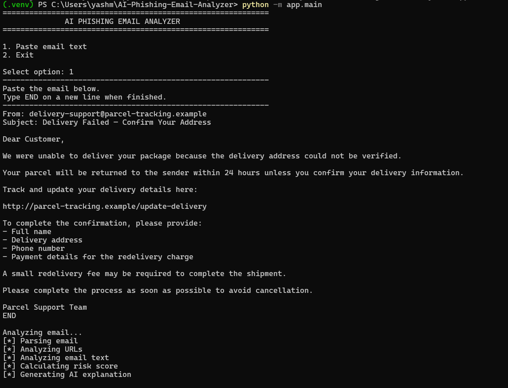
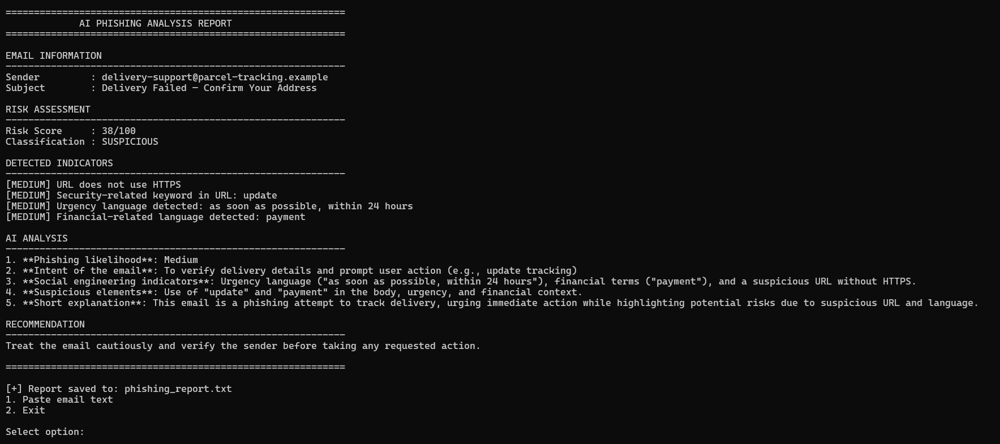

#  AI Phishing Email Analyzer

## 📌 About

A Python-based cybersecurity tool that analyzes emails for common phishing indicators, detects suspicious URLs and language patterns, calculates a risk score, and provides security recommendations.

## ✨ Features

- 📧 Email header and content analysis
- 🔗 Suspicious URL detection
- ⚠️ Phishing keyword detection
- 🔑 Credential-request detection
- 🚨 Urgency and financial-request detection
- 📊 Risk scoring
- 🤖 AI-assisted analysis
- 📄 Security report generation

## 🖥️ Screenshots

### Analyzer



### Phishing Detection Result



---

## 📂 Project Structure

```text
AI-Phishing-Email-Analyzer/
│
├── README.md
├── banner.png
├── requirements.txt
├── .gitignore
│
├── app/
│   ├── __init__.py
│   ├── main.py
│   │
│   ├── analyzer/
│   │   ├── __init__.py
│   │   ├── email_parser.py
│   │   ├── url_analyzer.py
│   │   ├── text_analyzer.py
│   │   └── risk_engine.py
│   │
│   ├── ai/
│   │   ├── __init__.py
│   │   └── ai_analyzer.py
│   │
│   └── reports/
│       ├── __init__.py
│       └── report_generator.py
│
├── tests/
│   ├── __init__.py
│   └── test_analyzer.py
│
├── samples/
│   ├── phishing.eml
│   └── legitimate.eml
│
└── screenshots/
    ├── analyzer.png
    └── phishing-result.png

---
## ⚙️ Installation

```bash
git clone https://github.com/Yashh91/AI-Phishing-Email-Analyzer.git
cd AI-Phishing-Email-Analyzer
pip install -r requirements.txt
---
## ▶️ Run

```bash
python -m app.main
The application will display:
1. Paste email text
2. Exit
Select 1, paste the email, and type END when finished.
---
## 📊 Risk Levels

| Score | Risk Level |
|------:|------------|
| 0–29 | 🟢 Low Risk |
| 30–59 | 🟡 Suspicious |
| 60–100 | 🔴 High Risk / Phishing |
---
## 🧪 Testing

Run the automated tests with:

```bash
pytest

---
## 🔒 Disclaimer

This project is intended for educational and authorized defensive-security testing only. It does not guarantee that an email is safe or malicious.
